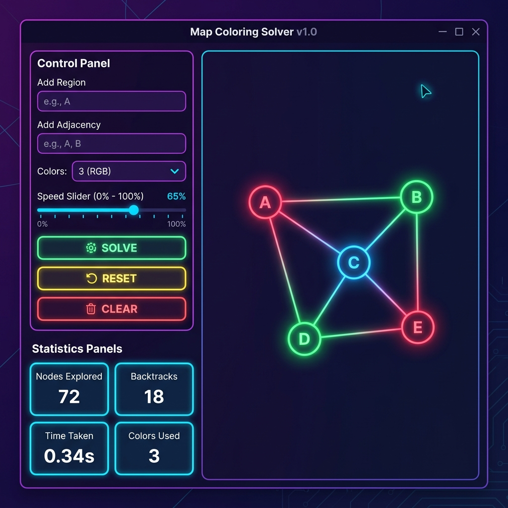
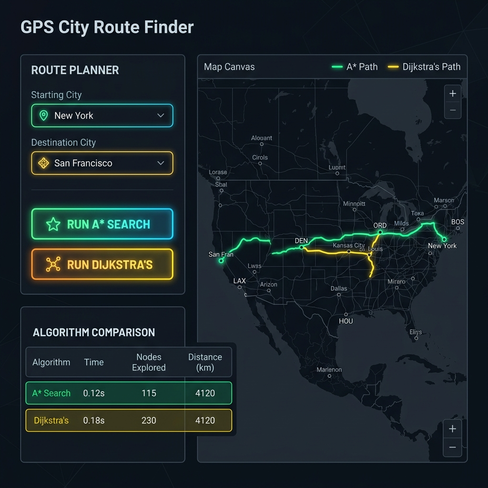

# 🤖 AI Problem Solving Assignment
**SRM University — Artificial Intelligence (2024-2028)**


## 📋 Overview

| # | Problem | Algorithm | Difficulty | Demo |
|---|---------|-----------|------------|------|
| 5 | Map Coloring Solver | CSP Backtracking + MRV | 🟢 Easy | [Live Demo](https://raw.githack.com/rajnikanthrg-cmd/AI-Problem-Solving-_-RA2411026050257/main/Problem5_MapColoring/index.html) |
| 11 | GPS Route Finder | A* + Dijkstra | 🟡 Medium | [Live Demo](https://raw.githack.com/rajnikanthrg-cmd/AI-Problem-Solving-_-RA2411026050257/main/Problem11_GPSRouteFinder/index.html) |
| 1 | Tic-Tac-Toe AI | Minimax + Alpha-Beta | 🔴 Hard | [Live Demo](https://raw.githack.com/rajnikanthrg-cmd/AI-Problem-Solving-_-RA2411026050257/main/Problem1_TicTacToe/index.html) |

---

## 🧩 Problems

### Problem 5: Map Coloring CSP Solver
**What it does:**  
An interactive visualizer that colors a generic map ensuring no two adjacent regions share the same color. It dynamically demonstrates how the algorithm assigns colors and backtracks when a conflict occurs.

**Algorithm used:** Constraint Satisfaction Problem (CSP) Backtracking with Minimum Remaining Values (MRV) heuristic.

**Key features:**
- Interactive graph editor to add regions and connections.
- Step-by-step visual execution of the backtracking algorithm.
- Performance statistics tracking backtracks and execution time.
- Professional dark-themed UI.



---

### Problem 11: GPS City Route Finder
**What it does:**  
A map-based routing simulation that calculates the shortest path between a starting city and a destination. It allows users to place nodes (cities) and define edges (roads) with associated distance weights.

**Algorithm used:** A* Search (with Euclidean distance heuristic) and Dijkstra's Algorithm.

**Key features:**
- Custom canvas-based graph editor for interactive map building.
- Side-by-side performance comparison of A* vs Dijkstra.
- Step-by-step visual execution log highlighting explored paths.
- Dynamic path reconstruction and cost calculation.



---

### Problem 1: Tic-Tac-Toe AI
**What it does:**  
An unbeatable Tic-Tac-Toe agent that plays flawlessly against human opponents. It includes an interactive analytics display to evaluate how the AI anticipates future moves.

**Algorithm used:** Minimax Algorithm with Alpha-Beta Pruning.

**Key features:**
- Unbeatable AI opponent playing optimally at all times.
- Local Human vs. Human multiplayer mode.
- Analytics comparing standard Minimax vs Alpha-Beta performance (nodes evaluated).
- Sophisticated professional chess-app style aesthetics.


---

## 📁 Repository Structure

```text
AI-Problem-Solving-_-RA2411026050257/
├── Problem5_MapColoring/
│   └── index.html
├── Problem11_GPSRouteFinder/
│   └── index.html
├── Problem1_TicTacToe/
│   └── index.html
└── README.md
```

## 🚀 How to Run

1. **Clone the repository:**
   ```bash
   git clone https://github.com/rajnikanthrg-cmd/AI-Problem-Solving-_-RA2411026050257.git
   ```
2. **Navigate** to any of the problem folders.
3. **Open** `index.html` directly in your web browser.
4. **No installation or local server required**! The applications are fully self-contained.

---

## 🧠 Algorithms Covered

This repository demonstrates the practical implementation of several fundamental Artificial Intelligence algorithms:
- **Constraint Satisfaction Problems (CSP)**
- **Backtracking Search**
- **Forward Checking**
- **Minimum Remaining Values (MRV) Heuristic**
- **A* Search**
- **Dijkstra's Algorithm**
- **Euclidean Distance Heuristic**
- **Minimax Algorithm**
- **Alpha-Beta Pruning**

---

## 👤 Author

**Rajnikanth RG**  
B.Tech AI & ML  
SRM Institute of Science and Technology (2024–2028)  
**Register Number:** RA2411026050257

Licensed under the [MIT License](LICENSE).
